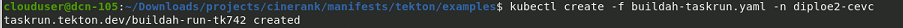
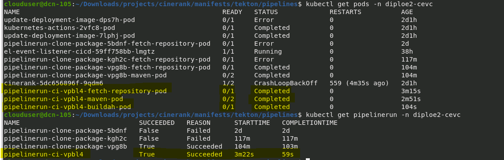

# Tekton: Framework de CI/CD para Kubernetes

Tekton es un framework **nativo de Kubernetes** para crear **pipelines de CI/CD**, diseñado para ser flexible, escalable y portable. Se usa para automatizar la construcción, prueba e implementación de aplicaciones dentro de Kubernetes y OpenShift.

## Herramienta 🛠️

* [Tekton](https://tekton.dev/)

## **¿Para qué sirve Tekton?**
Tekton permite definir flujos de trabajo (pipelines) como código, asegurando integración y despliegue continuo (CI/CD). Se basa en Kubernetes, lo que lo hace altamente escalable y reutilizable.

## **Principales Componentes de Tekton**
Tekton usa varios recursos de Kubernetes para definir y ejecutar pipelines:

- **Pipeline**: Define una secuencia de tareas a ejecutar.
- **Task**: Representa una unidad de trabajo dentro del pipeline, como compilar código o ejecutar pruebas.
- **Step**: Son los pasos dentro de una tarea. Cada paso suele ejecutarse en su propio contenedor.
- **PipelineRun**: Instancia de ejecución de un Pipeline.
- **TaskRun**: Instancia de ejecución de una Task.
- **Workspace**: Espacio de almacenamiento compartido entre tareas.
- **PipelineResource (obsoleto)**: Representaba entradas/salidas en un pipeline, pero fue reemplazado por Workspaces.
- **Trigger**: Permite iniciar pipelines de forma dinámica basándose en eventos (como un push a Git).

## **Componentes de Kubernetes que se usan en Tekton**
- **ServiceAccount**: Cada `PipelineRun` y `TaskRun` se ejecuta bajo un `ServiceAccount`, que define los permisos con los que puede operar.
- **Role y RoleBinding**: Kubernetes usa `Role` y `RoleBinding` para asignar permisos a un `ServiceAccount`, lo cual es clave para que Tekton gestione `Pods`, `ConfigMaps`, etc.
- **ConfigMap**: Almacena configuraciones en formato clave-valor. Tekton los usa para definir parámetros globales de ejecución.
- **Secretos (Secrets)**: Se usan para almacenar credenciales de acceso de manera segura, como credenciales de DockerHub o GitHub.
- **VPC (Virtual Private Cloud)**: No es un componente propio de Tekton, pero en entornos en la nube, los pipelines pueden interactuar con recursos dentro de una VPC para desplegar aplicaciones o acceder a bases de datos.


## **Comandos básicos de Tekton**
Tekton tiene una CLI llamada `tkn` que permite interactuar con pipelines y tareas. Algunos comandos útiles son:

### **1. Verificar instalación**
```sh
tkn version
```

### **2. Ver Pipelines y Tasks**
```sh
tkn pipeline list
tkn task list
```

### **3. Ejecutar un Pipeline**
```sh
tkn pipeline start <pipeline-name> --showlog
```

### **4. Ver logs de ejecución**
```sh
tkn pipelinerun logs <pipelinerun-name> -f
```

### **5. Eliminar recursos**
```sh
tkn pipeline delete <pipeline-name>
tkn task delete <task-name>
```
## **Comandos de Kubernetes que se pueden usar en Tekton**

### **1. Obtener información de recursos**
```sh
kubectl get pods
kubectl get deployments
kubectl get services
kubectl get configmaps
kubectl get secrets
kubectl get pvc
kubectl get all
```

### **2. Describir recursos**
```sh
kubectl describe pod <pod-name>
kubectl describe deployment <deployment-name>
kubectl describe service <service-name>
kubectl describe secret <secret-name>
```

### **3. Crear y eliminar recursos**
```sh
kubectl apply -f my-resource.yaml
kubectl delete -f my-resource.yaml
kubectl delete pod <pod-name>
kubectl delete deployment <deployment-name>
```


## **Ejecuciones en Practica 6**
Durante las practicas 6 se realizo la creacion y ejecucion de varias tareas que realizarian la descarga de nuestro repositorio, listado de documentos en carpeta, building, construccion de la imagen y por ultimo subirla a DockerHub para lo cual de inicio configuramos un `serviceAccount` llamado `tekton-sa` asi como su `role` y `rolebinding` para este `serviceAccount` posteriormente se realizo la descarga de varias tareas, posterior su ejecucion, creacion de un `PVC` y `configmap`





## **Pipelines**
En Tekton, una Pipeline es una definición de un conjunto de tareas que se ejecutan en secuencia o en paralelo para lograr un objetivo, como la construcción, prueba y despliegue de una aplicación. Una PipelineRun es una instancia específica de ejecución de una Pipeline.

En el caso de las primeras practicas usamos las task para la ejecucion de taskrun por separado, entenediendo el flujo composicion de una taskrun para despues concretar el entendimiento del concepto de las pipelines y pipelinesrn en tekton, donde ahora definimos las tareas dentro de la pipeline, para su ejecucion en taskrun, envio de params y asignamos un orden de ejecucion con el runAfter indicando cual seria la secuancialidad, siempre cuidando el tema de los workspaces entre tasks y configuracion de recursos previos como secretos, configmaps, persistVolumeClaims, serviceAccount, Role, RoleBinding entre otros.

Aqui el ejemplo de la practica con una ejecucion de pipeline que constaba de tres etapas o tareas a ejecutar.




### Authors ✒️

* **César Enrique**  - [cesarevc](https://github.com/cesarevc)

---
⌨️ Write by [cesarevc](https://github.com/cesarevc)